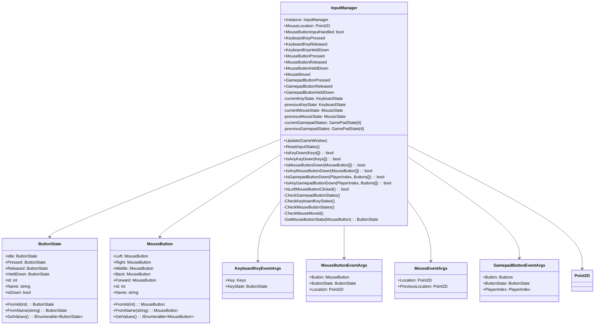
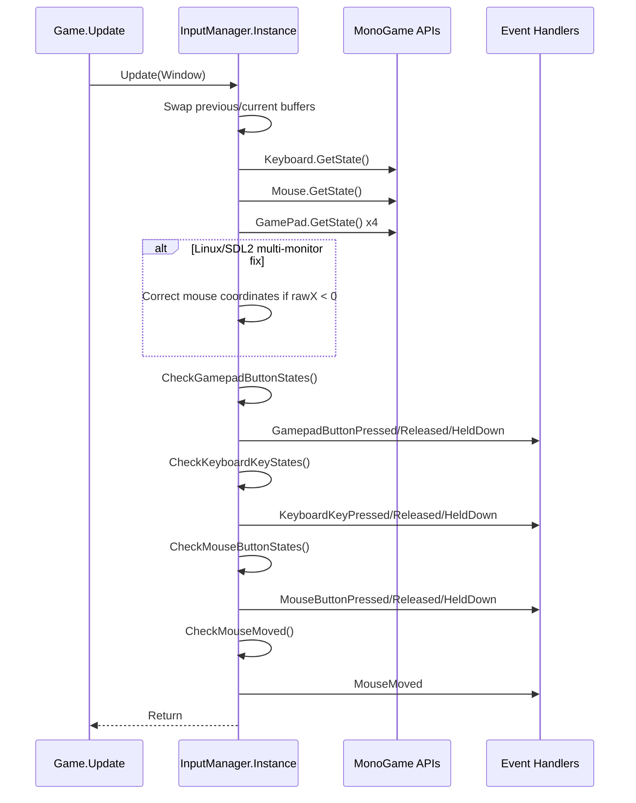
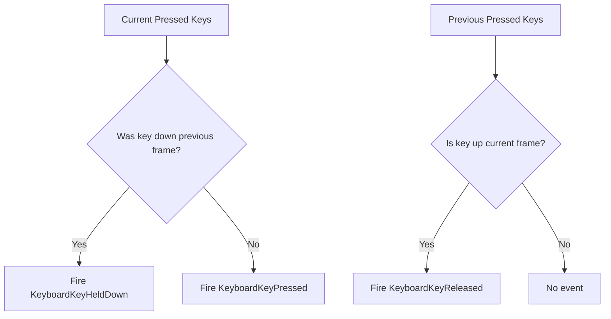
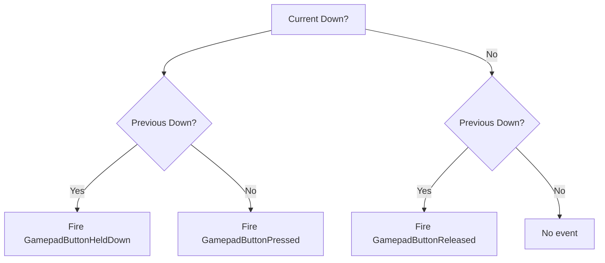
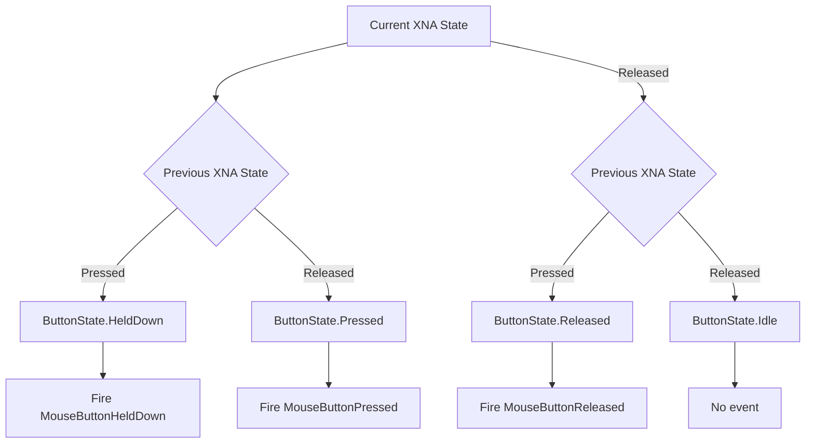

# NuciXNA.Input Architecture

This document describes the current architecture of NuciXNA.Input, a local input management library for MonoGame/XNA applications. It covers the library's system boundary, components, data flow, and integration model.

## 📑 Table of Contents

- Purpose
- System Context
- Architectural Style
- Runtime Flow
- Components
- Architectural Areas
- Data Architecture
- Interfaces and Integrations
- Key Flows
- Cross-Cutting Concerns
- Dependency Direction and Rules
- External Dependencies
- Deployment and Operations
- Compatibility Contracts
- Testing and Verification
- Design Constraints
- Extension Points
- Evolution and Migration
- Architecture Decisions
- Source Map
- Related Documentation

## 🎯 Purpose

NuciXNA.Input provides a lightweight, frame-based input management layer for MonoGame/XNA games. Its principal responsibilities are:

- Capturing keyboard, mouse, and gamepad state once per frame
- Deriving frame-relative transitions (Pressed, Released, HeldDown, Idle)
- Dispatching events to subscribers synchronously during the frame update
- Offering polling helpers for current button/key state queries

The library is a .NET class library (net10.0) distributed via NuGet. It has no process hosting, no network I/O, and no persistent state. The intended audience is game developers using MonoGame who need a higher-level input abstraction than raw `KeyboardState`/`MouseState`/`GamePadState`.

## 🌐 System Context

```mermaid
flowchart LR
    subgraph HostApp [Host Application Process]
        Game[Game.Update Loop]
        InputMgr[InputManager.Instance]
        Events[Event Handlers]
        Polling[Polling Consumers]
    end

    OS[(Operating System Input Subsystem)]
    MG[MonoGame.Framework.DesktopGL]
    Primitives[NuciXNA.Primitives]

    OS -->|Raw device state| MG
    MG -->|KeyboardState, MouseState, GamePadState| InputMgr
    Primitives -.->|Point2D struct| InputMgr
    InputMgr -->|Events| Events
    InputMgr -->|Polling results| Polling
    Game -->|Update(Window)| InputMgr
```

The principal external boundaries are:
- **Operating System Input Subsystem:** Provides raw keyboard, mouse, and gamepad state via MonoGame. The library does not interact with the OS directly.
- **MonoGame.Framework.DesktopGL:** Supplies `Keyboard`, `Mouse`, `GamePad`, `GameWindow` APIs. This is the only runtime dependency for device access.
- **NuciXNA.Primitives:** Supplies `Point2D` value type for coordinate representation. No I/O or state.
- **Host Application:** Calls `InputManager.Update(GameWindow)` once per frame, subscribes to events, and/or polls state. The library has no callbacks into the host except event invocation.

## 🏗️ Architectural Style

**Style:** Singleton façade over dual-buffered frame state with event-driven and polling interfaces.

**Implementation:**
- `InputManager` is a thread-safe singleton (`Instance` property with double-checked locking using `System.Threading.Lock`)
- Dual-buffer state: current frame + previous frame for keyboard, mouse, and 4 gamepads
- Frame update (`Update`) captures new state, swaps buffers, derives transitions, fires events
- Events are synchronous, multicast delegates invoked on the game thread
- Polling methods read current frame state only

**Consequences:**
- Single global input state per process — suitable for single-window games
- No dependency injection support without wrapper
- Event handlers must be fast (run inline during `Update`)
- No async or buffered event queue
- Testability limited by static `Keyboard.GetState()`/`Mouse.GetState()`/`GamePad.GetState()` calls



The principal architecture boundaries are:
- **InputManager (Singleton Façade):** Owns all input state, update loop, event dispatch, polling API. No external dependencies beyond MonoGame and Primitives.
- **State Types (ButtonState, MouseButton):** Immutable enum-like classes with factory methods, implicit conversions, value semantics. No dependencies.
- **Event Args (KeyboardKeyEventArgs, MouseButtonEventArgs, MouseEventArgs, GamepadButtonEventArgs):** DTOs for event data. Depend on `ButtonState`, `MouseButton`, `Point2D`, XNA enums.
- **Primitives Dependency:** `Point2D` from NuciXNA.Primitives — coordinate math only.

## 🔄 Runtime Flow



The principal runtime sequence is:
1. Host calls `InputManager.Instance.Update(Window)` once per frame from `Game.Update`
2. InputManager swaps previous/current state buffers (no allocation)
3. InputManager captures current frame state from MonoGame static APIs
4. Linux coordinate fix applied if mouse X < 0 (virtual desktop correction)
5. Gamepad button transitions checked for all 4 players × all Buttons enum values
6. Keyboard key transitions checked (pressed keys + previously pressed keys)
7. Mouse button transitions checked for all 5 MouseButton values
8. Mouse movement checked (position equality)
9. Events fired synchronously for each transition
10. Control returns to host

## 🧩 Components

| Component | Responsibility | Principal Dependencies | Lifetime or Ownership |
|-----------|----------------|------------------------|-----------------------|
| `InputManager` | Singleton façade; frame update, state capture, transition derivation, event dispatch, polling API | `MonoGame.Framework.DesktopGL` (Keyboard, Mouse, GamePad, GameWindow), `NuciXNA.Primitives` (Point2D) | Process singleton; created on first `Instance` access |
| `ButtonState` | Frame-relative button state (Idle, Pressed, Released, HeldDown); factories, conversions, equality | None (pure) | Immutable singletons; static lifetime |
| `MouseButton` | Mouse button abstraction (Left, Right, Middle, Back, Forward); factories, conversions, equality | None (pure) | Immutable singletons; static lifetime |
| `KeyboardKeyEventArgs` | Event data for keyboard transitions | `Microsoft.Xna.Framework.Input.Keys`, `ButtonState` | Allocated per event per frame |
| `MouseButtonEventArgs` | Event data for mouse button transitions | `MouseButton`, `ButtonState`, `Point2D` | Allocated per event per frame |
| `MouseEventArgs` | Event data for mouse movement | `Point2D` (current, previous) | Allocated per frame if moved |
| `GamepadButtonEventArgs` | Event data for gamepad transitions | `Microsoft.Xna.Framework.Input.Buttons`, `ButtonState`, `PlayerIndex` | Allocated per event per frame |

## 🗂️ Architectural Areas

### Core Library (`NuciXNA.Input/`)

Paths:
- `NuciXNA.Input/InputManager.cs`
- `NuciXNA.Input/ButtonState.cs`
- `NuciXNA.Input/MouseButton.cs`
- `NuciXNA.Input/KeyboardKeyEvent.cs`
- `NuciXNA.Input/MouseButtonEvent.cs`
- `NuciXNA.Input/MouseEvent.cs`
- `NuciXNA.Input/GamepadButtonEvent.cs`

Responsibilities:
- All public API surface
- Frame state management
- Event system
- Polling helpers
- Linux coordinate fix

Boundary rules:
- No file I/O, network I/O, or inter-process communication
- No persistent state
- All MonoGame access through static APIs
- Single-threaded execution assumed (game thread)

### Unit Tests (`NuciXNA.Input.UnitTests/`)

Paths:
- `NuciXNA.Input.UnitTests/ButtonStateTests.cs`
- `NuciXNA.Input.UnitTests/KeyboardKeyEventArgsTests.cs`
- `NuciXNA.Input.UnitTests/MouseButtonTests.cs`
- `NuciXNA.Input.UnitTests/MouseButtonEventArgsTests.cs`
- `NuciXNA.Input.UnitTests/MouseEventArgsTests.cs`
- `NuciXNA.Input.UnitTests/GamepadButtonEventArgsTests.cs`

Responsibilities:
- Verify enum-like class contracts (factories, conversions, equality)
- Verify event args construction
- No integration tests for `InputManager.Update()` event firing or state transitions

Boundary rules:
- Test project references main project
- Uses NUnit 4 + NUnit3TestAdapter
- Requires MonoGame.Framework.DesktopGL for XNA types

## 💾 Data Architecture

```mermaid
flowchart TD
    OS[(OS Input)] --> MG[MonoGame State Types]
    MG -->|KeyboardState| IM[InputManager]
    MG -->|MouseState| IM
    MG -->|GamePadState[4]| IM
    IM -->|Swap| Prev[Previous Frame Buffer]
    IM -->|Capture| Curr[Current Frame Buffer]
    Curr -->|Compare| Transitions[Transition Derivation]
    Transitions -->|ButtonState| Events[Event Args]
    Transitions -->|ButtonState| Polling[Polling Results]
    Events --> Handlers[Event Handlers]
    Polling --> Consumers[Polling Consumers]
```

| Data or Store | Owner | Representation and Storage | Lifecycle or Consistency |
|---------------|-------|----------------------------|--------------------------|
| `currentKeyState` / `previousKeyState` | `InputManager` | `Microsoft.Xna.Framework.Input.KeyboardState` (struct) | Swapped each frame; overwritten by `Keyboard.GetState()` |
| `currentMouseState` / `previousMouseState` | `InputManager` | `Microsoft.Xna.Framework.Input.MouseState` (struct) | Swapped each frame; overwritten by `Mouse.GetState()`; Linux fix may allocate new `MouseState` |
| `currentGamepadStates` / `previousGamepadStates` | `InputManager` | `Microsoft.Xna.Framework.Input.GamePadState[4]` (array of structs) | Swapped each frame; overwritten by `GamePad.GetState()` per player |
| `ButtonState` instances | `ButtonState` class | 4 static readonly singletons (`Idle`, `Pressed`, `Released`, `HeldDown`) | Process lifetime; immutable |
| `MouseButton` instances | `MouseButton` class | 5 static readonly singletons (`Left`, `Right`, `Middle`, `Back`, `Forward`) | Process lifetime; immutable |
| Event args (`KeyboardKeyEventArgs`, etc.) | `InputManager` (allocator) | Class instances with readonly properties | Allocated per event per frame; GC collected |
| `Point2D` coordinates | `NuciXNA.Primitives` | `readonly struct Point2D { X, Y }` | Value type; copied on assignment |

No persistence, caching, or migration. All state is transient frame-to-frame.

## 🔌 Interfaces and Integrations

| Interface or Integration | Direction | Contract | Owner | Failure Semantics |
|--------------------------|-----------|----------|-------|-------------------|
| `InputManager.Update(GameWindow)` | Inbound (host → library) | Called once per frame; `Window` provides `ClientBounds` for Linux fix | Host application | If not called, state stales; no exception |
| `InputManager.Instance` | Inbound (host → library) | Thread-safe singleton accessor | Library | Never throws after first init |
| Event subscriptions (`+=`) | Inbound (host → library) | Standard .NET multicast delegates; invoked synchronously during `Update` | Host application | Handler exceptions propagate to `Update` caller |
| Polling methods (`IsKeyDown`, etc.) | Inbound (host → library) | Read current frame state; return `bool` | Host application | Never throws |
| `MonoGame.Framework.DesktopGL` | Outbound (library → framework) | Static `Keyboard.GetState()`, `Mouse.GetState()`, `GamePad.GetState()`, `GameWindow.ClientBounds` | Library | Exceptions from MonoGame propagate |
| `NuciXNA.Primitives.Point2D` | Outbound (library → dependency) | `readonly struct` with `X`, `Y`, operators | Library | Never throws |

## 🔑 Key Flows

### Frame Update Flow

```mermaid
flowchart TD
    A[Game.Update] --> B[InputManager.Update(Window)]
    B --> C[Swap Buffers]
    C --> D[Capture KeyboardState]
    C --> E[Capture MouseState]
    C --> F[Capture GamePadState x4]
    E --> G{rawX < 0?}
    G -->|Yes| H[Correct Coordinates]
    G -->|No| I[Use Raw]
    H --> J[CheckGamepadButtonStates]
    I --> J
    D --> J
    J --> K[CheckKeyboardKeyStates]
    K --> L[CheckMouseButtonStates]
    L --> M[CheckMouseMoved]
    M --> N[Return]
```

### Keyboard Transition Flow



### Gamepad Transition Flow (per player, per button)



### Mouse Button Transition Flow (per button)



## 🛡️ Cross-Cutting Concerns

### Concurrency
- `InputManager.Instance` uses `System.Threading.Lock` (C# 13+) for thread-safe singleton creation
- `Update()` and all polling methods are **not thread-safe** — must be called from game thread
- Event handlers execute on game thread during `Update()`
- No internal synchronization for state reads during `Update()`

### Error Handling
- No try/catch in library code
- Exceptions from MonoGame (`Keyboard.GetState()`, etc.) propagate to caller
- Event handler exceptions propagate to `Update()` caller
- Factory methods (`FromId`, `FromName`) throw `ArgumentException` for invalid input

### Configuration
- No configuration API
- Linux coordinate fix is automatic (triggered by `rawX < 0`)
- Workaround fields (`MouseButtonInputHandled`, `IsLeftMouseButtonClicked`) are public but marked TODO for removal

### Observability
- No logging, metrics, or tracing
- No debug hooks

### Resource Management
- No `IDisposable` — no unmanaged resources
- Event args allocated per frame (GC pressure ~80 objects/frame worst case)
- Dual-buffer arrays swapped (no allocation)

## ➡️ Dependency Direction and Rules

```
Host Application
    │
    ▼
NuciXNA.Input (library)
    │
    ├──► MonoGame.Framework.DesktopGL (runtime dependency)
    │
    └──► NuciXNA.Primitives (compile-time + runtime)
```

**Rules:**
- Library depends only on MonoGame and NuciXNA.Primitives
- No reverse dependencies (MonoGame does not reference NuciXNA.Input)
- No circular dependencies
- Host application references library only
- Test project references library + MonoGame + NUnit

**Prohibited:**
- Library referencing host application types
- Library performing I/O (file, network, IPC)
- Library spawning threads

## 📦 External Dependencies

| Dependency | Version | Purpose | Architectural Responsibility |
|------------|---------|---------|------------------------------|
| `MonoGame.Framework.DesktopGL` | 3.8.4 | `Keyboard`, `Mouse`, `GamePad`, `GameWindow`, `Keys`, `Buttons`, `PlayerIndex`, `ButtonState` (XNA) | Sole source of device state; abstracts OS input |
| `NuciXNA.Primitives` | 2.1.7 | `Point2D` struct, mapping extensions | Coordinate representation and math |
| `Microsoft.NET.Test.Sdk` | 18.7.0 | Test runner | Test infrastructure only |
| `NUnit` | 4.6.1 | Test framework | Test infrastructure only |
| `NUnit3TestAdapter` | 6.2.0 | Test adapter | Test infrastructure only |

## 🚀 Deployment and Operations

**Process Topology:** In-process library within host MonoGame application. No separate process, service, or daemon.

**Deployment Model:** NuGet package (`NuciXNA.Input`) consumed by host project at build time. Also available as GitHub Release assets.

**Persistent State:** None. Library holds no persistent state across process restarts.

**Scaling Assumptions:** Single-window, single-threaded game loop. Not designed for multi-window, headless, or server scenarios.

**Operational Consequences:**
- Host controls update frequency (typically 60Hz)
- Host controls focus handling (should call `ResetInputStates()` on deactivation)
- Host controls event subscription lifetime
- No operational configuration

## 🤝 Compatibility Contracts

| Contract | Owner | Invariant | Verification | Change Policy |
|----------|-------|-----------|--------------|---------------|
| Public API surface (`InputManager`, event args, `ButtonState`, `MouseButton`) | Library | Method signatures, event delegate types, enum-like class members stable | Compile-time; NuGet package validation | Semantic versioning; breaking changes require major version |
| Event firing order (gamepad → keyboard → mouse buttons → mouse move) | Library | Order preserved per `Update()` call | Not automatically verified | Considered implementation detail; may change in minor version |
| `ButtonState`/`MouseButton` implicit conversions (`int`, `string`) | Library | Conversion behavior preserved | Unit tests | Stable; part of public contract |
| Linux coordinate fix behavior | Library | Applied when `rawX < 0` | Not automatically verified | May be refined in patch version |
| Target framework (`net10.0`) | Library | Compiles and runs on .NET 10.0 | CI build | Updated with .NET LTS/releases |

## 🧪 Testing and Verification

**Test Boundaries:**
- Unit tests only (no integration tests)
- Event args construction verified
- Enum-like class contracts verified (factories, conversions, equality, `ToString`, `GetHashCode`)
- `InputManager.Update()` event firing **not tested**
- State transition logic **not tested**
- Linux coordinate fix **not tested**
- Polling methods **not tested**

**Executable Verification:**
```bash
dotnet build NuciXNA.Input.sln
dotnet test NuciXNA.Input.sln
```

**CI Pipeline:** `.github/workflows/dotnet.yml` — Ubuntu latest, .NET 10.0.x, restore → build → test.

**Material Coverage Gaps:**
- `InputManager.Update()` end-to-end behavior
- Frame transition logic (Pressed/Released/HeldDown/Idle)
- Multi-frame sequences (press → hold → release)
- Gamepad connection/disconnection
- Linux multi-monitor coordinate correction (Y-axis incomplete)
- Concurrent access to `Instance` and `Update()`
- Workaround fields behavior

**Prohibitions:** No external service calls in tests; no UI automation.

## ⚙️ Design Constraints

| Constraint | Description | Trade-off |
|------------|-------------|-----------|
| Singleton pattern | Global `InputManager.Instance` | Simple access; hard to test, not DI-friendly |
| Dual-buffer frame state | Current + previous frame swapped each frame | Zero allocation; requires `Update()` called every frame |
| Synchronous events | Delegates invoked inline during `Update()` | Low latency; handlers block frame |
| Exhaustive gamepad check | 4 players × all Buttons enum every frame | Simplicity; ~68 checks/frame even if disconnected |
| Static MonoGame APIs | `Keyboard.GetState()`, etc. | No abstraction; hard to mock for tests |
| No analog gamepad support | Only digital `Buttons` enum | Simpler API; missing thumbsticks/triggers |
| No touch/text input | Keyboard/mouse/gamepad only | Focused scope; consumers use MonoGame directly |
| net10.0 target | .NET 10.0 only | Modern APIs (`Lock`, collection expressions); narrower compatibility |

## 🔌 Extension Points

| Extension Point | Contract | Registration/Integration |
|-----------------|----------|--------------------------|
| Event subscription | `+=` on `InputManager` events | Host code in `Initialize()` |
| Polling API | `IsKeyDown`, `IsAnyKeyDown`, etc. | Host code in `Update()` |
| `ResetInputStates()` | Public method | Host code on focus loss |
| Wrapper for DI | Implement `IInputManager` forwarding to `Instance` | Host DI container |

No plugin system, no interface-based substitution within library.

## 📈 Evolution and Migration

**Current State (2.1.x):**
- net10.0 target
- MonoGame 3.8.x
- Singleton `InputManager`
- Workaround fields present (`MouseButtonInputHandled`, `IsLeftMouseButtonClicked`)
- No analog gamepad, touch, text input, mouse wheel events

**Planned (3.x):**
- Remove workaround fields
- Add analog gamepad support (thumbsticks, triggers)
- Add touch input (`TouchPanel` integration)
- Add text input events (wrap `Window.TextInput`)
- Add mouse wheel events
- Fix Linux Y-axis coordinate correction
- Consider `IInputManager` interface for DI
- Consider netstandard2.0 target for wider compatibility

**Migration Path:**
- 2.x → 3.x: Breaking changes likely (removed workaround fields, new events)
- Semantic versioning: major version for breaking changes

## 📝 Architecture Decisions

| Decision | Rationale | Evidence |
|----------|-----------|----------|
| Singleton `InputManager` | Simple global access for game-wide input | `InputManager.Instance` property with `Lock` |
| Dual-buffer swap (no allocation) | Avoid GC pressure at 60fps | `Update()` swaps array references |
| Enum-like classes (`ButtonState`, `MouseButton`) | Type safety, implicit conversions, extensibility | `ButtonState.cs`, `MouseButton.cs` with `implicit operator` |
| Synchronous multicast events | Low latency, simple mental model | `event` fields in `InputManager` |
| Linux coordinate fix in `Update()` | Transparent to consumers | `InputManager.cs` lines 65-75 |
| Workaround fields public but TODO | Temporary fix for upstream issue | `InputManager.cs` lines 430-434 |
| No analog gamepad | Scope limitation; digital buttons sufficient for many games | `CheckGamepadButtonStates()` only iterates `Buttons` enum |

## 🗺️ Source Map

| Area | Repository-Relative Paths |
|------|---------------------------|
| Solution | `NuciXNA.Input.sln` |
| Main Library | `NuciXNA.Input/` |
|  ├─ InputManager | `NuciXNA.Input/InputManager.cs` |
|  ├─ State Types | `NuciXNA.Input/ButtonState.cs`, `NuciXNA.Input/MouseButton.cs` |
|  ├─ Keyboard Events | `NuciXNA.Input/KeyboardKeyEvent.cs` |
|  ├─ Mouse Events | `NuciXNA.Input/MouseButtonEvent.cs`, `NuciXNA.Input/MouseEvent.cs` |
|  ├─ Gamepad Events | `NuciXNA.Input/GamepadButtonEvent.cs` |
|  ├─ Project Config | `NuciXNA.Input/NuciXNA.Input.csproj` |
| Unit Tests | `NuciXNA.Input.UnitTests/` |
|  ├─ State Type Tests | `NuciXNA.Input.UnitTests/ButtonStateTests.cs`, `NuciXNA.Input.UnitTests/MouseButtonTests.cs` |
|  ├─ Event Args Tests | `NuciXNA.Input.UnitTests/KeyboardKeyEventArgsTests.cs`, `NuciXNA.Input.UnitTests/MouseButtonEventArgsTests.cs`, `NuciXNA.Input.UnitTests/MouseEventArgsTests.cs`, `NuciXNA.Input.UnitTests/GamepadButtonEventArgsTests.cs` |
|  ├─ Project Config | `NuciXNA.Input.UnitTests/NuciXNA.Input.UnitTests.csproj` |
| CI/CD | `.github/workflows/dotnet.yml` |
| Documentation | `docs/` (architecture.md, api-reference.md, usage-guide.md, event-system.md, state-management.md, integration.md, testing.md, known-issues.md, README.md) |
| Root Docs | `README.md`, `LICENSE`, `PRIVACY.md`, `SECURITY.md` |

## 📚 Related Documentation

| Document | Scope |
|----------|-------|
| `docs/architecture.md` | Detailed architecture with implementation specifics (complements this file) |
| `docs/api-reference.md` | Complete public API signatures |
| `docs/usage-guide.md` | Installation, setup, patterns, best practices |
| `docs/event-system.md` | Event flow, subscription patterns, argument details |
| `docs/state-management.md` | Frame-based state model, transition logic, polling implementation |
| `docs/integration.md` | MonoGame integration, screen management, DI, multiplayer |
| `docs/testing.md` | Test structure, coverage, gaps, recommended additions |
| `docs/known-issues.md` | Limitations, bugs, workarounds, platform notes |
| `PRIVACY.md` | Data handling (none — local only) |
| `SECURITY.md` | Vulnerability reporting policy |
| `README.md` | Project overview, quick start, features |
| `LICENSE` | GPL-3.0-or-later |